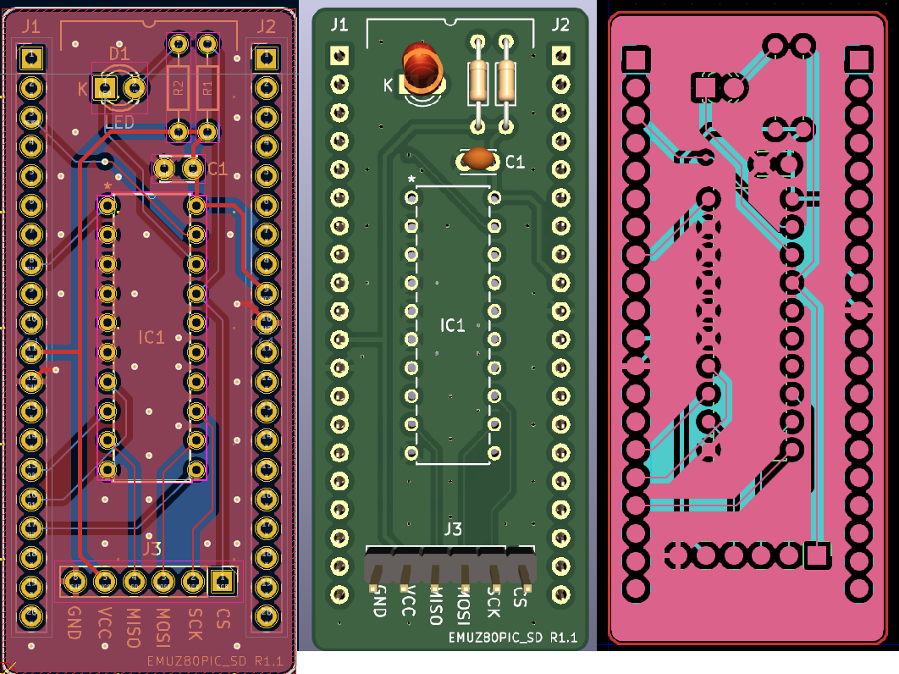

# EMUZ80PIC_SD

EMUZ80PIC_SDは、EMUZ80にアドオンするμSDカードモジュールです。 
 
EMUZ80+SuperMEZ80、または、EMUZ80+MEZZ180RAMの組み合わせで、CP/M-80 Ver2.2を走らせることが出来ます。 
 
 

 
# SuperMEZ80 + EMUZ80PIC_SD

 
# MEZZ180RAM + EMUZ80PIC_SD

 
@hanyazouさんのファームウェアを、EMUZ80PIC_SD用にカスタマイズしてあります。 
 
＜＠hanyazouさんのソース＞ 
https://github.com/hanyazou/SuperMEZ80/tree/mez80ram-cpm 
 
ソースのコンパイルは、マイクロチップ社の「MPLAB® X Integrated Development Environment (IDE)」 
で行っております。（MPLAB X IDE v6.10）コンパイラは、XC8を使用しています。
https://www.microchip.com/en-us/tools-resources/develop/mplab-x-ide 
 
Z80のアセンブラは、Macro Assembler AS V1.42を使用しています。 
http://john.ccac.rwth-aachen.de:8000/as/ 
 
FatFsはR0.15を使用しています。 
＜FatFs - Generic FAT Filesystem Module＞ 
http://elm-chan.org/fsw/ff/00index_e.html 
 
SDカード上のCP/Mイメージファイルの作成は、CpmtoolsGUIを利用しています。 
＜CpmtoolsGUI - neko Java Home Page＞ 
http://star.gmobb.jp/koji/cgi/wiki.cgi?page=CpmtoolsGUI 
 
また、IPL, BOOT, BIOS等の修正で、毎回イメージファイルを作るのは面倒なので、 
バイナリーエディタ「xedit」を利用しています。ファイルをバイナリレベルで修正 
出来るので便利です。 
https://janus.blog.ss-blog.jp/2016-06-17 
 
（オリジナルのリンクが切れているようです） 
フリーソフト１００からもダウンロードできます。 
https://freesoft-100.com/pasokon/editor_binary.html 
 
＜参考＞ 
・EMUZ80 
EUMZ80はZ80CPUとPIC18F47Q43のDIP40ピンIC2つで構成されるシンプルなコンピュータです。 
 
＜電脳伝説 - EMUZ80が完成＞   
https://vintagechips.wordpress.com/2022/03/05/emuz80_reference   
＜EMUZ80専用プリント基板 - オレンジピコショップ＞   
https://store.shopping.yahoo.co.jp/orangepicoshop/pico-a-051.html 
 
・SuperMEZ80 
SuperMEZ80は、EMUZ80にSRAMを追加し、Z80をノーウェイトで動かすことができるメザニンボードです 
 
SuperMEZ80 
https://github.com/satoshiokue/MEZ80RAM 
https://github.com/satoshiokue/SuperMEZ80 
 
・MEZZ180RAM 
MEZZ180RAMは、EMUZ80にZ180+SRAMのメザニンボードです。HD64180R/ZやZ8S180が動作します。 
 
MEZZ180RAM 
https://github.com/satoshiokue/MEZZ180RAM 
https://github.com/satoshiokue/EMUZ80-Z180RAM 
